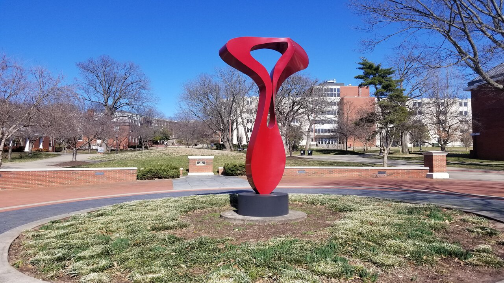
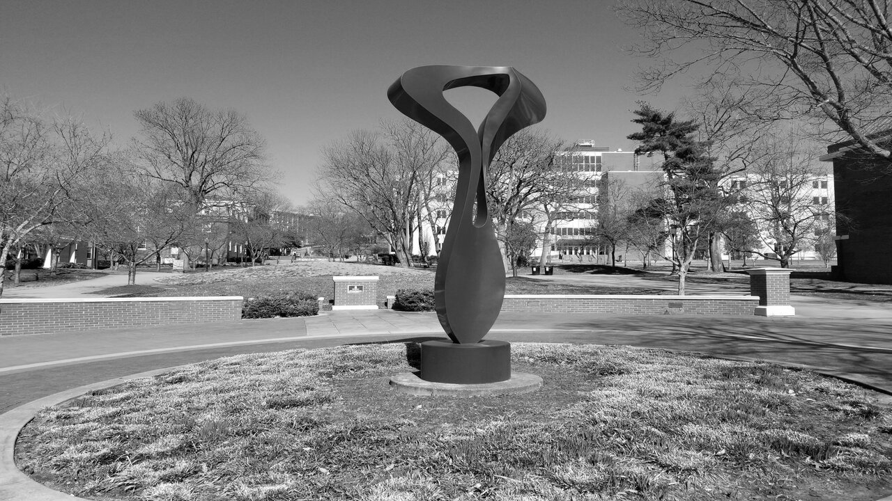
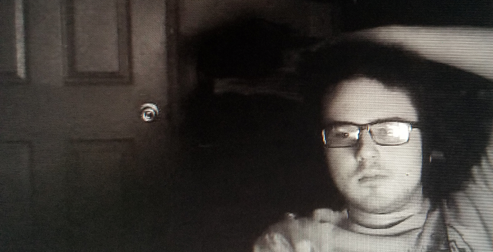
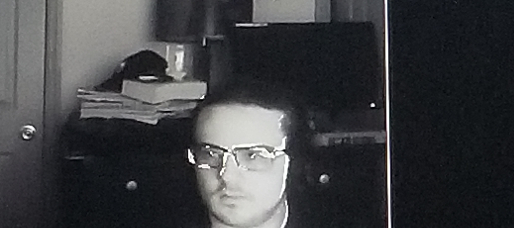

# Process Comparisons Between the Raspberry Pi’s CPU and GPU

## Abstract
In this paper, we used the GPU and CPU of a Canakit Raspberry Pi 3 to test their efficiency compared to one another. We performed two experiments to test this. The first of these experiments was a pencil drawing experiment, in which we checked the speed at which the GPU and CPU were each able to process the images they were provided. The second experiment was processing a video for anomalies, during which each component was once again monitored for its speed.
For the first experiment, we found that the RPi CPU was faster than the GPU. The margin between them, however, quickly dropped with larger image sizes. Where the CPU was over sixteen times faster with the first set of images, this quickly dropped to eight times faster with the third. While GPU times being longer than the CPU equivalent was unexpected, this does support GPUs becoming more effective with larger graphical processes, a result which is consistent with prior works in this area. 
In the second experiment, we found very similar results. The GPU was much slower than the CPU, and yet once again it showed a trend indicating that, given a sufficiently large and complex input, the GPU would eventually outpace the CPU. In its case, the minimum percent increase in average processing time for the CPU was almost double the GPU's maximum.

## Screenshots

### Experiment 1 - Grayscale an Image




### Experiment 2 - Anomaly Detection




## OpenCL examples

### Experiment 1 - Grayscale an Image
The formula utilized to grayscale the pixel values was ***RGB[A] to Gray: Y←0.299 * R + 0.587 * G + 0.114 * B***
```
float* gpuOperation(bool &isAdd, float intArray[], float floatArray[], int size){

    std::vector<cl::Platform> all_platforms;
    cl::Platform::get(&all_platforms);
    
    if(all_platforms.size()==0){
        std::cout<<" No platforms found. Check OpenCL installation!\n";
        exit(1);
    }
    
    cl::Platform default_platform=all_platforms[0];
    std::cout << "Using platform: "<<default_platform.getInfo<CL_PLATFORM_NAME>()<<"\n";

    std::vector<cl::Device> all_devices;
    default_platform.getDevices(CL_DEVICE_TYPE_GPU, &all_devices);
    
    if(all_devices.size()==0){
        std::cout<<" No devices found. Check OpenCL installation!\n";
        exit(1);
    }
    
    cl::Device default_device=all_devices[0];
    std::cout<< "Using device: "<<default_device.getInfo<CL_DEVICE_NAME>()<<"\n";


    cl::Context context({default_device});

    cl::Program::Sources sources;

    std::string kernel_code;
    if(isAdd){ 
    kernel_code=
            "   void kernel math(global const float* A, global const float* B, global float* C){       "
            "       C[get_global_id(0)]=A[get_global_id(0)]+B[get_global_id(0)];                 "
            "   }                                                                               ";
    }
    if(!isAdd){
    kernel_code=
            "   void kernel math(global const float* A, global const float* B, global float* C){       "
            "       C[get_global_id(0)]=A[get_global_id(0)]*B[get_global_id(0)];                 "
            "   }                                                                               ";
    }
    sources.push_back({kernel_code.c_str(),kernel_code.length()});


    cl::Program program(context,sources);
    
    if(program.build({default_device})!=CL_SUCCESS){
        std::cout<<" Error building: "<<program.getBuildInfo<CL_PROGRAM_BUILD_LOG>(default_device)<<"\n";
        exit(1);
    }
    

    cl::Buffer buffer_A(context,CL_MEM_READ_WRITE,sizeof(float)*size);
    cl::Buffer buffer_B(context,CL_MEM_READ_WRITE,sizeof(float)*size);
    cl::Buffer buffer_C(context,CL_MEM_READ_WRITE,sizeof(float)*size);

    cl::CommandQueue queue(context,default_device);

    queue.enqueueWriteBuffer(buffer_A,CL_TRUE,0,sizeof(float)*size,intArray);
    queue.enqueueWriteBuffer(buffer_B,CL_TRUE,0,sizeof(float)*size,floatArray);

    cl::Kernel kernel_add=cl::Kernel(program,"math");
    kernel_add.setArg(0,buffer_A);
    kernel_add.setArg(1,buffer_B);
    kernel_add.setArg(2,buffer_C);
    queue.enqueueNDRangeKernel(kernel_add,cl::NullRange,cl::NDRange(size),cl::NullRange);
    queue.finish();
    
    float *C;
    C = (float*) malloc(size*sizeof(float));

    queue.enqueueReadBuffer(buffer_C,CL_TRUE,0,sizeof(float)*size,C);

    return C;
}
```

### Experiment 2 - Anomaly Detection 

Motion was defined as the difference in luminosity between two frames. The threshold that consituted motion was set at a value ***greater or equal to 70***.

```
int* gpuOperation(int frameOne[], int frameTwo[], int size){

    std::vector<cl::Platform> all_platforms;
    cl::Platform::get(&all_platforms);
    
   /* 
    if(all_platforms.size()==0){
        std::cout<<" No platforms found. Check OpenCL installation!\n";
        exit(1);
    }
   */ 
    cl::Platform default_platform=all_platforms[0];
    //std::cout << "Using platform: "<<default_platform.getInfo<CL_PLATFORM_NAME>()<<"\n";

    std::vector<cl::Device> all_devices;
    default_platform.getDevices(CL_DEVICE_TYPE_GPU, &all_devices);
    
   /* 
    if(all_devices.size()==0){
        std::cout<<" No devices found. Check OpenCL installation!\n";
        exit(1);
    }
   */ 
    cl::Device default_device=all_devices[0];
    //std::cout<< "Using device: "<<default_device.getInfo<CL_DEVICE_NAME>()<<"\n";


    cl::Context context({default_device});

    cl::Program::Sources sources;
 
    string kernel_code=
            "   void kernel math(global const int* A, global const int* C, global int* B){                     "
            "       B[get_global_id(0)]=abs(A[get_global_id(0)]-C[get_global_id(0)]);                               "
            "   }                                                                               ";

    sources.push_back({kernel_code.c_str(),kernel_code.length()});


    cl::Program program(context,sources);
    
    program.build({default_device});
    /*
    if(program.build({default_device})!=CL_SUCCESS){
        std::cout<<" Error building: "<<program.getBuildInfo<CL_PROGRAM_BUILD_LOG>(default_device)<<"\n";
        exit(1);
    }
    */

    cl::Buffer buffer_A(context,CL_MEM_READ_WRITE,sizeof(int)*size);
    cl::Buffer buffer_C(context,CL_MEM_READ_WRITE,sizeof(int)*size);
    cl::Buffer buffer_B(context,CL_MEM_READ_WRITE,sizeof(int)*size);

    cl::CommandQueue queue(context,default_device);

    queue.enqueueWriteBuffer(buffer_A,CL_TRUE,0,sizeof(int)*size,frameOne);
    queue.enqueueWriteBuffer(buffer_C,CL_TRUE,0,sizeof(int)*size,frameTwo);

    cl::Kernel kernel_add=cl::Kernel(program,"math");
    kernel_add.setArg(0,buffer_A);
    kernel_add.setArg(1,buffer_C);
    kernel_add.setArg(2,buffer_B);
    queue.enqueueNDRangeKernel(kernel_add,cl::NullRange,cl::NDRange(size),cl::NullRange);
    queue.finish();
   
    int *frameThreeDiff; 
    frameThreeDiff = (int*) malloc(size*sizeof(int));	

    queue.enqueueReadBuffer(buffer_B,CL_TRUE,0,sizeof(int)*size,frameThreeDiff);
/*	
    for(int i=0;i<1000;i++)
         {
		
         }
*/	
    return frameThreeDiff;
}
```

## OpenCV examples

### Experiment 1 - Grayscale an Image 

The formula utilized to grayscale the pixel values was ***RGB[A] to Gray: Y←0.299 * R + 0.587 * G + 0.114 * B***

```
int* cpuOperation(Mat image, float BGRweights[], int size){

	int counter = 0;

	int* grayArray;
	grayArray = (int *) malloc(size*sizeof(int));
	
	for(int row=0;row<image.rows;row++)
	{
		for(int col=0;col<image.cols;col++)
		{
			int B = (int) image.at<Vec3b>(row, col)[0] * BGRweights[0];
			int G = (int) image.at<Vec3b>(row, col)[1] * BGRweights[1]; 
			int R = (int) image.at<Vec3b>(row, col)[2] * BGRweights[2];
			grayArray[counter]=B+G+R;	
			counter++;
		}
	}

        return grayArray;
}
```

### Experiment 2 - Anomaly Detection

```
			for(int row=0;row<grayMyImage.rows;row++)
			{
				for(int col=0;col<grayMyImage.cols;col++)
				{
					
					int f1px = frameOne[counter];
					int f2px = frameTwo[counter];
					int diffPixel = abs(f1px-f2px);
					frameThreeDiff[counter]=diffPixel;	
					counter++;
					
					if(diffPixel > 70)
					{
						grayMyImage.at<Vec3b>(row, col)[0] = 255;
					}
					
				}
			}
```

## Result Figures


## Conclusions and Future Work
In conclusion, we found that sufficiently small tasks led to the Raspberry Pi's CPU heavily outpacing the GPU in terms of speed, with the gap between the two increasing as tasks grew smaller. While this differed from previous works, it is easily explained by differences in hardware. The Raspberry Pi is a relatively weak and simple computer, and its capabilities are not comparable to many of the devices tested in similar experiments. This is further backed by an instance of our experiments agreeing with their predecessors, this being the existence of a trend in which the GPU's performance relative to the CPU steadily increases with larger and more complex tasks. According to the trend, had technical issues not prevented larger tasks from being tested, the RPi GPU's performance would have eventually outpaced that of the RPi CPU. This trend is clearly present in our experiments. Both show that when complexity is increased, the GPU takes relatively less additional time to handle that complexity. Since the CPU's processing time rose at a higher rate than the GPU's, it logically follows that the CPU's processing time will eventually meet and surpass that of the GPU with a sufficiently complex task.

There is plentiful area for more work on the subject in the future. As an example, one could determine how to overcome the crashing issue of our GPU-based grayscaling program. This would make it possible to verify that the GPU eventually overcomes the CPU's performance, as well as when this occurs. We have already had some successes in this area ourselves, though it has come with its own issues on the side. Additionally, one could compare both various models of Pi and various GPUs in general. Our own experiment was limited by using specifically the CPU and GPU of the Canakit RPi3, which we believe was likely a major reason for the GPU falling behind. A broader test of various CPUs and GPUs could provide a better picture of how various models of each compare.

Similarly, our second experiment also leaves plenty of room to be expanded. Like the pencil drawing experiment, it was heavily limited by the hardware of the RPi3. This forced us to take actions such as grayscaling the image before working with it, which would not be necessary with more resourceful hardware. Future work on this side could include attempting the video processing experiment with color video. It could also investigate how a lower or higher luminosity threshold affects the efficiency of the CPU and GPU, compared to our threshold set solely at 70. Additionally, it too could be tested with a broader set of hardware.

## Contact Me!
Author: Ethan Moore  
Email: eldm2350@protonmail.com  
Github: https://github.com/eldm-ethanmoore  
LinkedIn: https://www.linkedin.com/in/ethan-moore-a7106121a/  